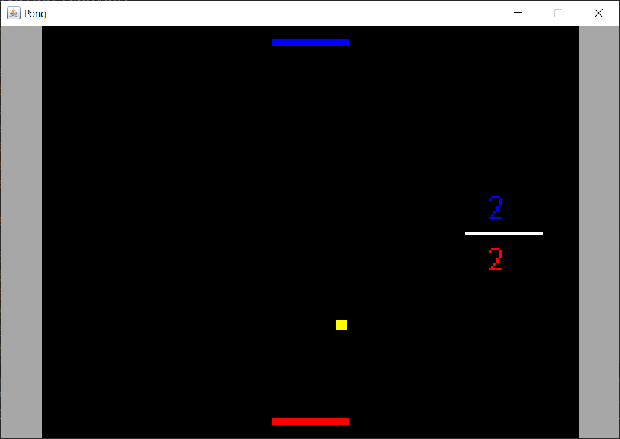

</img>

# Overview 

This is a project of the a game called _pong_ created in Java, use this project for your fun :happy:

### Instructions

**A** / **D** - move the blue player

**Arrow left** / **Arrow right** - move the red player

**Novo Jogo** / New Game

**Carregar** / Load

**Sair** / Exit

<h2 style="text-align:center;">In game</h2>

</img>